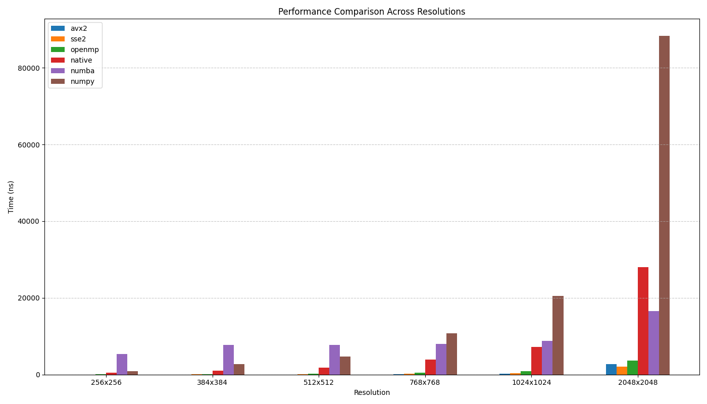

# Image-Fusion
Image fusion implementation in C++ and assembly


## Introduction
Image-Fusion is a process of replacing the image background based on image matting. By using a formal mathematical expression we can describe this process, namely:
```math
I_{\text{result}} = I_{\text{source}} \cdot \alpha + I_{\text{target}} \cdot (1 - \alpha)
```
Generally, the $I_{\text{target}}$ is a pure white image with the same resolution as $I_{\text{source}}$. After the image fusion process, the background of the original image can be replaced with the specified image which result can be found in `asset`.


## Build
```python
python setup.py build_ext --inplace
```

## Performance
- note: the resolution of the test image is 700x700 which can be found in `asset`
- run the following code to test the performance: 
```python
python benchmark.py
```


<div align="center">

| method| implement     | 256x256   | 384x384   | 512x512   | 768x768   | 1024x1024 | 2048x2048 |
|:------|:--------------|:----------|:----------|:----------|:----------|:----------|:----------|
| avx2  | avx2+openmp   | 9         | 16        | 28        | 90        | 185       | 2675      |
| sse2  | sse2+openmp   | 25        | 54        | 95        | 213       | 373       | 2084      |
| openmp| native openmp | 56        | 124       | 215       | 471       | 880       | 3600      |
| native| native cpp    | 467       | 1008      | 1766      | 3922      | 7193      | 28044     |
| numba | numpy+numba   | 5338      | 7741      | 7779      | 7970      | 8752      | 16545     |
| numpy | pure numpy    | 951       | 2689      | 4662      | 10787     | 20479     | 88348     |

</div>


<div align="center">



</div>
